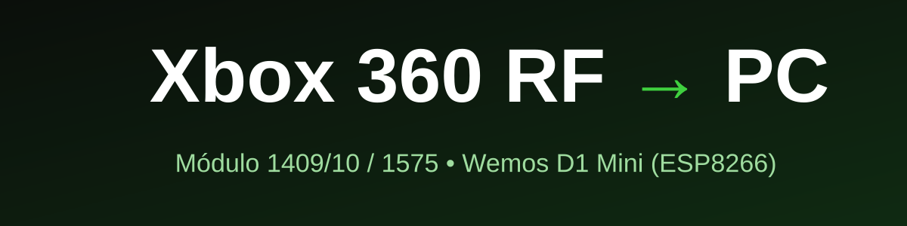

  

  

  

  

  

  

  

  
# Xbox 360 RF Module → PC (ESP8266)

Usando módulo RF (**modelo 1409/10 / 1575**) do Xbox 360 Slim(E) como receptor sem fio para controles no PC, via USB.

O **Wemos D1 Mini** controla os LEDs, a animação de boot e o pareamento (Sync). Os dados dos controles passam direto pelo **D+/D-** para o PC.
  

---

## ✨ Funcionalidades
  

- 🔆 Inicialização dos LEDs e animação de boot
- 🔗 Pareamento pelo botão Sync físico do módulo
- 🟢 Toque curto: ***Sync***
- 🔴 Segurar 3s: **Desliga** os controles conectados
- ⏱️ Timeout no clock, que evita travar o watchdog do ESP

  
---
  
## 🧰 Hardware

| Item      | Descrição                             |
| --------- | ------------------------------------- |
| Módulo RF | Xbox 360 RF 1410 / 1575 (X864907-004) |
| MCU       | Wemos D1 Mini (ESP8266, CH340)        |
| Cabo      | USB com 4 fios (+5V, D+, D-, GND)     |
  

---

## 🔌 Ligações (Wiring)

  

  

| Módulo RF   | Cor         | Destino                     |
| ----------- | ----------- | --------------------------- |
| Data        | 🩷 Rosa     | D2 (GPIO4)                  |
| Clock       | 🔵 Azul     | D1 (GPIO5)                  |
| Sync Button | 🟡 Amarelo  | D5 (GPIO14)                 |
| 3.3V        | 🟠 Laranja  | 3.3V (Wemos)                |
| GND         | ⚫ Preto     | GND (Wemos + USB)           |
| USB D+      | 🟢 Verde    | D+ do cabo USB              |
| USB D-      | ⚪ Cinza     | D- do cabo USB              |
| —           | 🔴 Vermelho | +5V do cabo → VBUS do Wemos |
> ⚠️ O módulo RF funciona com **3,3V**. Não ligue o módulo em 5V.

  
---

## 🚀 Instalação
 

1. Instale o **core ESP8266** na Arduino IDE.

   - Em *Preferências → URLs adicionais*, adicione:

     `https://arduino.esp8266.com/stable/package_esp8266com_index.json`

2. Selecione a placa **LOLIN(WEMOS) D1 R2 & mini**.

3. Abra `Xbox360_RF_ESP8266.ino` e faça o upload.

4. No Windows, instale o driver **Xbox 360 Wireless Receiver for Windows**.

---
  
## 🛠️ Troubleshooting

- **`TIMEOUT` na Serial:** clock e data podem estar invertidos, ou o módulo está sem 3,3V.

- **Controle não aparece no PC:** verifique o D+/D- e o driver do receptor.

- **LEDs dos quadrantes não respondem:** teste outros códigos com `x<hex>`.

---
## 🙏 Créditos
 
   # **THANKS SKYNET**
 
- [appliedcarbon.org](https://www.appliedcarbon.org/xboxrf.html)

- [dazzaXx/Xbox360RFArduino](https://github.com/dazzaXx/Xbox360RFArduino)

- [AuraudZ/xbox-rf](https://github.com/AuraudZ/xbox-rf)

- [gr33nonline](https://gr33nonline.wordpress.com/2015/09/19/make-an-xbox-receiver/)

- [ginokgx/xbox360slimRF](https://github.com/ginokgx/xbox360slimRF) 

---  

## 📄 Licença

MIT. *Xbox* é marca registrada da Microsoft. Este projeto não é afiliado à Microsoft.